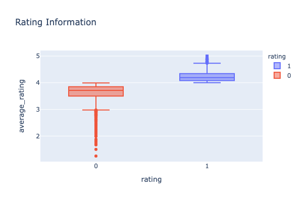
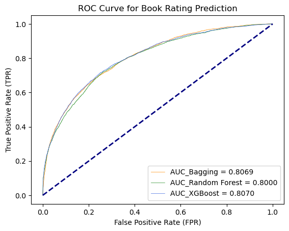

# Book Rating Prediction

## Project Background
Explore NLP and Classification models to predict book rating (high/low) based on:
- Book Description (Text Data)
- Book Author (Author Average Rating - Numeric Data)
- Book Publisher (Top Publisher Name - One Hot Encoding on Publisher Catergory)

## Dataset
**Dataset source**: [USCD Book Graph](https://sites.google.com/eng.ucsd.edu/ucsdbookgraph/home)

## Data Preprocessing
**Text Preprocessing** - Please refer to Notebook1

Clean the Description Text Data, steps inlcuding:
- Check text data column impurity
- Remove HTML/RegExp Tags using regexpression cleaning by importing re
- Remove newline/whitespace tags
- Adjust double dashes, remove punctuations and numbers
- Using fasttext to detect English language
- Word Vectorization, using NLTK library to remove stop words and lemmatize words

**Data Processing** - Please refer to Notebook1 & Notebook2
- Remove the duplicated book records due to different languages/editions for the same book
- Combine book, user interaction and author dataset to prepare for modeling

## Modeling (Classification)
Please refer to Notebook3
Applied Logistic Regression with bagging ensemble method, Random Forest Classifer(Decision Tree), Enhance the Random Forest with XGBoost

## Summary

Applied different classifiers on the book dataset to predict book rating,

- Base model Logistic Regression f1 score: 0.71
- Applied ensemble methods, including bagging on Logistic Regression, Random Forest, and XGBoost, model performance improved to around 0.74.
- Overall, prediction result for class 1 is much lower, one potential reason is the imbalanced dataset, where class 1 (high reviews) accounts for 41% of total dataset, and with smaller variance compared to class 0.
- Bagging and Random Forest are underfitting while XGB is singificantly overfitted, further processes such as feature engineering and parameters tuning as the next steps to improve the model.
