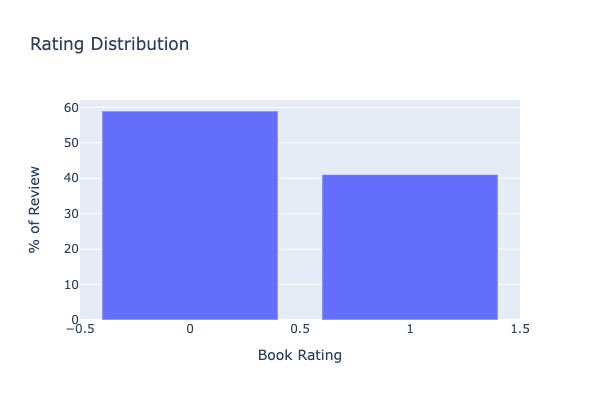
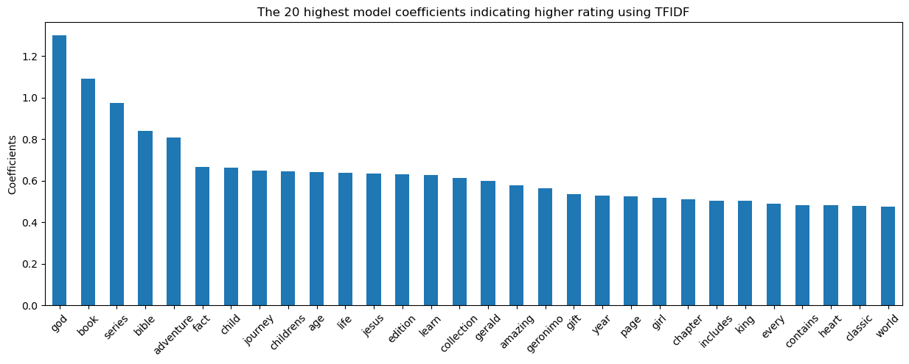

# Book Rating Prediction

## Project Background
Explore NLP and Classification models to predict book rating (high/low) based on:
- Book Description (Text Data)
- Book Author (Author Average Rating - Numeric Data)
- Book Publisher (Top Publisher Name - One Hot Encoding on Publisher Catergory)

## Dataset
**Dataset source**: [USCD Book Graph](https://sites.google.com/eng.ucsd.edu/ucsdbookgraph/home)

## Data Preprocessing
**Text Preprocessing** - Please refer to Notebook1

Clean the Description Text Data, steps inlcuding:
- Check text data column impurity
- Remove HTML/RegExp Tags using regexpression cleaning by importing re
- Remove newline/whitespace tags
- Adjust double dashes, remove punctuations and numbers
- Using fasttext to detect English language
- Word Vectorization, using NLTK library to remove stop words and lemmatize words

**Data Processing** - Please refer to Notebook1 & Notebook2
- Remove the duplicated book records due to different languages/editions for the same book
- Combine book, user interaction and author dataset to prepare for modeling

Book Rating Distribution   |  Book Rating Box Plot
:-------------------------:|:-------------------------:
  |  

## Modeling (Classification)
Please refer to Notebook3
**Features**
- Lemmatized words from book description text (~6000 features)
- Book author average rating (one column applied MinMaxScaler)
- Top book publisher via One Hot Encoding (~30 features)

### Base model: Logistic Regression

Base model identified the top words that are more associated with higher ratings, such as like 'gerald'-character in "Elephant & Piggie", 'geronimo' - character of Geronimo Stilton, are quite popluar Children's books with very good reviews. Words with high coefficients also include 'series', 'edition', 'collection' etc., which shows that books with series are tend to related more with high ratings. And in fact, when books with good rating, they tend to generate more following up series.

### Bagging (Ensemble Model) on Logistic Regression
Applied Bagging method on Logistic Regression, which improved f1 score from 71% to 73%.

### Random Forest
Applied Random Forest to allow non-linear separation for the model.

### XGBoosting on Random Forest
Applied XGBoosting to enhance the underfitting with the previous Random Forest Model.

Applied Logistic Regression with bagging ensemble method, Random Forest Classifer(Decision Tree), Enhance the Random Forest with XGBoost

## Summary

Applied different classifiers on the book dataset to predict book rating,

- Base model Logistic Regression f1 score: 0.71
- Applied ensemble methods, including bagging on Logistic Regression, Random Forest, and XGBoost, model performance improved to around 0.74.
- Overall, prediction result for class 1 is much lower, one potential reason is the imbalanced dataset, where class 1 (high reviews) accounts for 41% of total dataset, and with smaller variance compared to class 0.
- Bagging and Random Forest are underfitting while XGB is singificantly overfitted, further processes such as feature engineering and parameters tuning as the next steps to improve the model.

